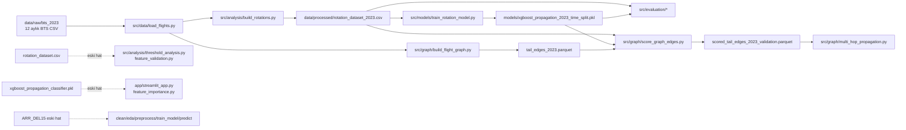

# AeroRecover AI Mimari ve Dosya Kullanım Denetimi

Denetim tarihi: 6 Ağustos 2026  
Kapsam: Depodaki kaynak kod, yapılandırma, çalıştırma girişleri ve artefakt metadata'sı  
Yöntem: Salt okunur statik inceleme; veri/model dosyaları açılmadı, eğitim veya uygulama çalıştırılmadı.

## 1. Yönetici özeti

Güncel ve kanıtlanabilir ana hat şöyledir: `src/data/load_flights.py`, 2023'e ait 12 aylık BTS dosyasını yükler; `src/analysis/build_rotations.py`, `rotation_dataset_2023.csv` üretir; `src/models/train_rotation_model.py`, bu veri setini kronolojik olarak train (Ocak-Ağustos), validation (Eylül-Ekim) ve test (Kasım-Aralık) ayırıp `xgboost_propagation_2023_time_split.pkl` üretir. Validation tabanlı değerlendirme, kalibrasyon, SHAP ve graph skorlama dosyaları aynı veri/model çiftini kullanır. Graph hattı `tail_edges_2023.parquet` → `scored_tail_edges_2023_validation.parquet` şeklindedir.

Depoda bunun yanında iki eski hat bulunur. Birincisi `ARR_DEL15` hedefli genel uçuş gecikmesi hattıdır (`clean_data.py`, `eda.py`, `preprocess_data.py`, `train_model.py`, `predict.py`, `xgboost_model.pkl`). Bu hat güncel propagation hedefini kullanmaz ve `preprocess_data()` tek DataFrame döndürdüğü hâlde `train_model.py` dört değer beklediği için mevcut hâliyle bozuktur. İkincisi `rotation_dataset.csv` ve `xgboost_propagation_classifier.pkl` kullanan önceki propagation analiz/uygulama hattıdır. Güncel artefaktla uyumlu değildir.

`src/evaluation/threshold_analysis.py` validation üzerinde 0.40–0.50 aralığını tarar ancak 0.46'yı sabit bir çalışma eşiği olarak uygulamaz. 0.46 eşiğini güncel modelle açıkça kullanan dosyalar `src/analysis/shap_analysis.py`, `src/graph/score_graph_edges.py` ve (skorlanmış edge girdisi üzerinden) `src/graph/multi_hop_propagation.py` dosyalarıdır. `src/evaluation/evaluate_rotation_model.py` güncel modeli kullanır fakat `model.predict()` varsayılan sınıf eşiğine dayanır; dolayısıyla 0.46 ile tam uyumlu değildir.

Denetim başlangıcında çalışma ağacı temiz değildi:

```text
 M src/graph/build_flight_graph.py
 M src/graph/multi_hop_propagation.py
```

Bu iki mevcut kullanıcı değişikliği korunmuş, geri alınmamış ve değiştirilmemiştir. Denetim hiçbir mevcut dosyayı silmemiş, taşımamış, yeniden adlandırmamış veya düzenlememiştir; yalnızca bu rapor oluşturulmuştur.

## 2. Mevcut klasör yapısı

```text
AeroRecover-AI/
├── app/                         # Streamlit karar destek arayüzü
├── data/
│   ├── raw/                    # BTS 2023, eski tek-ay veri ve referans verileri
│   ├── interim/                # yalnız .gitkeep
│   └── processed/              # rotation CSV'leri ve graph parquet'leri
├── models/                     # beş pickle model artefaktı
├── notebooks/                  # ilk veri keşif notebook'u
├── reports/
│   ├── figures/                # kalibrasyon ve SHAP çıktıları
│   └── tables/                 # yalnız .gitkeep
├── src/
│   ├── analysis/               # rotation, EDA, önem/SHAP/risk analizleri
│   ├── data/                   # yükleme ve eski hazırlama araçları
│   ├── decision_support/       # kural tabanlı öneriler
│   ├── evaluation/             # güncel validation değerlendirmeleri
│   ├── features/               # şimdilik iskelet
│   ├── graph/                  # graph kurma, skorlama, multi-hop
│   ├── models/                 # eski ve güncel eğitim/tahmin
│   ├── network/                # şimdilik iskelet
│   └── optimization/           # risk ve öneri orkestrasyonu
├── tests/                      # boş
├── .gitignore
├── README.md                   # boş
└── requirements.txt
```

Artefakt metadata'sı: `rotation_dataset.csv` 74,047,825 bayt; `rotation_dataset_2023.csv` 975,482,941 bayt; `tail_edges_2023.parquet` 174,885,386 bayt; `scored_tail_edges_2023_validation.parquet` 28,156,842 bayt; güncel model 445,653 bayttır. `data/raw/bts_2023` altında 12 aylık CSV vardır (her biri yaklaşık 110–133 MB). Bu dosyaların içeriği okunmamıştır.

## 3. Uçtan uca veri akışı

1. `load_flights.py`, `data/raw/bts_2023/bts_2023_*.csv` deseninden tam 12 dosya bekler ve seçili sütunları birleştirir.
2. `build_rotations.py`, kuyruk numarası ve gün içinde sıralama, ardışık uçuş bağlantısı, turnaround ve gecikme özellikleri üretir. Hedefi `LATE_AIRCRAFT_DELAY >= 15` üzerinden `IS_DELAY_PROPAGATED` olarak tanımlar ve `rotation_dataset_2023.csv` yazar.
3. `train_rotation_model.py`, bu CSV'nin yalnız model sütunlarını okur; Ocak-Ağustos train, Eylül-Ekim validation, Kasım-Aralık test maskeleri oluşturur. Yalnız train üzerinde fit eder ve güncel modeli yazar. Kod test verisini fit/evaluation için kullanmaz; test kilidi statik incelemede korunuyor görünmektedir.
4. `threshold_analysis.py` (evaluation), validation olasılıklarında 0.40–0.50 eşiklerini kıyaslar. Seçilmiş 0.46, graph skorlama ve SHAP'ta sabittir.
5. `build_flight_graph.py`, ham uçuşlardan fiziksel tail bağlantı edge'lerini üretir. `score_graph_edges.py`, validation rotation skorlarını hedef uçuş ID'siyle edge'lere ekler. `multi_hop_propagation.py`, skorlanmış edge'lerden zincirleri çıkarır.
6. Streamlit katmanı model olasılığı/SHAP ile kural tabanlı risk, risk faktörü ve önerileri bir araya getirir; ancak eski `xgboost_propagation_classifier.pkl` dosyasını yüklediğinden güncel eğitim hattına bağlı değildir.

## 4. Mermaid veri akışı diyagramı



## 5. Dosya envanteri tablosu

Kategori değerlendirmesi silme kararı değildir. İskelet `__init__.py` dosyaları paket yapısının parçası oldukları için ilgili paketle birlikte değerlendirilmiştir.

| Dosya | Görev | Kim kullanıyor? | Girdi | Çıktı | Kategori | Kanıt | Güven |
|---|---|---|---|---|---|---|---|
| `src/data/load_flights.py` | 12 aylık BTS yükleyici | rotations, graph, clean, explore, preprocess, EDA | `data/raw/bts_2023/bts_2023_*.csv` | DataFrame | AKTİF | Güncel rotation ve graph doğrudan import ediyor | Yüksek |
| `src/analysis/build_rotations.py` | Rotation özellik/hedef üretimi | doğrudan CLI | `load_flights()` | `rotation_dataset_2023.csv` | AKTİF | Çıktı sabiti ve main içindeki `to_csv` | Yüksek |
| `src/models/train_rotation_model.py` | Kronolojik propagation eğitimi | evaluation, SHAP, graph importları; CLI | `rotation_dataset_2023.csv` | güncel time-split model | AKTİF | `DATA_PATH`, `MODEL_PATH`, `joblib.dump` birebir eşleşiyor | Yüksek |
| `src/evaluation/threshold_analysis.py` | Validation eşik taraması | doğrudan CLI | güncel dataset/model | konsol tablosu | AKTİF | time-mask ve 0.40–0.50 taraması | Yüksek |
| `src/evaluation/evaluate_rotation_model.py` | Validation metrikleri | doğrudan CLI | güncel dataset/model | konsol metrikleri | YARDIMCI | Güncel path; 0.46 yerine `model.predict()` | Yüksek |
| `src/evaluation/calibration_analysis.py` | Validation kalibrasyonu | doğrudan CLI | güncel dataset/model | calibration PNG | YARDIMCI | Güncel path ve validation maskesi | Yüksek |
| `src/analysis/shap_analysis.py` | Validation SHAP açıklamaları | doğrudan betik/importta çalışır | güncel dataset/model | üç 2023 validation PNG | YARDIMCI | Güncel path, 0.46; tüm iş üst seviyede | Yüksek |
| `src/graph/build_flight_graph.py` | Tail node/edge üretimi | doğrudan CLI, score çıktısını okur | ham 2023 BTS | `tail_edges_2023.parquet` | AKTİF | `save_tail_edges()` ve score tüketimi | Yüksek |
| `src/graph/score_graph_edges.py` | Validation edge skorlama | doğrudan CLI, multi-hop tüketir | güncel rotation/model + tail edges | scored validation parquet | AKTİF | 0.46 ve üç girdinin açık path'leri | Yüksek |
| `src/graph/multi_hop_propagation.py` | Tahmin/gerçek zincir analizi | doğrudan CLI | scored validation parquet | konsol zincir özeti | AKTİF | Graph hattının nihai tüketicisi | Yüksek |
| `src/decision_support/recommendation_engine.py` | Kural tabanlı aksiyon önerileri | Streamlit, optimizer | uçuş özellik sözlüğü | öneri listesi | AKTİF | İki aktif tüketici import ediyor | Yüksek |
| `src/optimization/recovery_optimizer.py` | Risk seviyesi/faktörü ve rapor orkestrasyonu | Streamlit, CLI | uçuş özellik sözlüğü | risk/öneri | AKTİF | Streamlit üç fonksiyonu import ediyor | Yüksek |
| `app/streamlit_app.py` | Açıklama ve karar destek UI | `streamlit run` olası giriş | eski classifier model + kullanıcı girdisi | etkileşimli UI | ESKİ/BOZUK ADAYI | Eski model path'i; README çalıştırma yönergesi yok | Yüksek |
| `src/analysis/threshold_analysis.py` | Kural tabanlı operasyonel risk skoru/ROC | optimizer ve CLI | `rotation_dataset.csv` | grafik/konsol | ESKİ/BOZUK ADAYI | Eski dataset; buna karşın skorlama fonksiyonu canlı import ediliyor | Yüksek |
| `src/analysis/feature_validation.py` | Rotation özelliklerinin grup analizi | doğrudan betik/importta çalışır | `rotation_dataset.csv` | konsol | ESKİ/BOZUK ADAYI | Eski dataset path'i ve üst seviye ağır okuma | Yüksek |
| `src/analysis/feature_importance.py` | XGBoost importance dökümü | doğrudan betik/importta çalışır | eski classifier model | konsol | ESKİ/BOZUK ADAYI | Eski model path'i | Yüksek |
| `src/analysis/inspect_model_inputs.py` | Model giriş adlarını yazdırır | doğrudan betik/importta çalışır | eski classifier model | konsol | ESKİ/BOZUK ADAYI | Eski model path'i ve göreli yol | Yüksek |
| `src/data/clean_data.py` | ARR_DEL15 temizlik deneyi | referans yok; doğrudan çalıştırılabilir | tüm ham uçuşlar | bellek/konsol | ESKİ/BOZUK ADAYI | Güncel hedef değil, üst seviyede tam yükleme | Yüksek |
| `src/data/explore_data.py` | ARR_DEL15 ham veri keşfi | referans yok; doğrudan çalıştırılabilir | tüm ham uçuşlar | konsol | TEKRAR ADAYI | EDA ile örtüşür; güncel hedef değil | Yüksek |
| `src/analysis/eda.py` | ARR_DEL15 grafiksel EDA | doğrudan CLI | tüm ham uçuşlar | interaktif grafik/konsol | ESKİ/BOZUK ADAYI | ARR_DEL15 hattı; explore ile kısmi tekrar | Yüksek |
| `src/data/preprocess_data.py` | Eski model için veri sağlama iskeleti | `train_model.py`, CLI | tüm ham uçuşlar | tek DataFrame | ESKİ/BOZUK ADAYI | Tüketici dört dönüş değeri bekliyor | Yüksek |
| `src/models/train_model.py` | Eski genel gecikme modeli | doğrudan CLI | preprocess sonucu | `xgboost_model.pkl` | ESKİ/BOZUK ADAYI | Güncel hedef değil; unpack sözleşmesi bozuk | Yüksek |
| `src/models/predict.py` | Eski model için interaktif tahmin | doğrudan CLI | `xgboost_model.pkl` + stdin | konsol | ESKİ/BOZUK ADAYI | Eski genel model/özellik şeması | Yüksek |
| `src/models/evaluate_model.py` | Değerlendirme iskeleti | referans yok | yok | yok | TEKRAR ADAYI | Yalnız docstring; evaluation paketi gerçek işi yapıyor | Yüksek |
| `src/network/build_flight_network.py` | Network iskeleti | referans yok | yok | yok | TEKRAR ADAYI | Yalnız docstring; graph paketi gerçek işi yapıyor | Yüksek |
| `src/features/build_features.py` | Feature iskeleti | referans yok | yok | yok | BELİRSİZ | Yalnız docstring; hedef mimaride yeri olabilir | Orta |
| `src/data/load_aircraft.py` | Aircraft loader iskeleti | referans yok | yok | yok | BELİRSİZ | Yalnız docstring; ham aircraft verisi mevcut | Orta |
| `src/data/load_airports.py` | Airport loader iskeleti | referans yok | yok | yok | BELİRSİZ | Yalnız docstring; ham airport verisi mevcut | Orta |
| `src/data/inspect_downloads.py` | Gelen aylık dosya kalite kontrolü | doğrudan betik/importta çalışır | `data/raw/incoming_2023/*.csv` | konsol | ESKİ/BOZUK ADAYI | Mevcut bilinen ham yol `bts_2023`; beklenen klasör yok | Yüksek |
| `notebooks/01_data_exploration.ipynb` | İlk keşif notebook'u | manuel Jupyter | belirtilmemiş | notebook çıktıları | YARDIMCI | Takipli bağımsız analiz artefaktı; pipeline importu yok | Orta |
| `README.md` | Proje/run dokümantasyonu | kullanıcı | yok | doküman | ESKİ/BOZUK ADAYI | Dosya 0 bayt; çalıştırma kontratı yok | Yüksek |
| `requirements.txt` | Python bağımlılıkları | kurulum | paket listesi | ortam | AKTİF | pandas/xgboost/shap/streamlit vb. var | Orta |
| `.gitignore` | Üretilen/büyük dosya dışlama | Git | desenler | ignore politikası | AKTİF | Raw/processed/models/cache/reports desenleri doğrulandı | Yüksek |
| `src/**/__init__.py` | Paket sınırları | Python import sistemi | yok | paketler | AKTİF | Tüm kaynak alt paketlerinde mevcut | Yüksek |
| `data/raw/download_data.py` | Ham veri indirme betiği | manuel olası | ağ | raw dosya | YARDIMCI | Yol/ad metadata'sı; içerik güvenlik gereği okunmadı | Düşük |
| `data/raw/DOWNLOAD_INSTRUCTIONS.md` | Ham veri edinme yönergesi | kullanıcı | yok | doküman | YARDIMCI | Yol/ad metadata'sı; içerik okunmadı | Düşük |
| `data/processed/rotation_dataset_2023.csv` | Güncel rotation veri seti | train/evaluation/SHAP/score | build_rotations | CSV | OTOMATİK ÜRETİLEN | Üretici ve tüketici path'leri eşleşir | Yüksek |
| `data/processed/rotation_dataset.csv` | Eski rotation veri seti | eski threshold/feature validation | eski/tespit edilemeyen üretici | CSV | ESKİ/BOZUK ADAYI | Güncel üretici bu adı yazmıyor | Yüksek |
| `data/processed/graph/tail_edges_2023.parquet` | Fiziksel tail edge tablosu | score_graph_edges | build_flight_graph | parquet | OTOMATİK ÜRETİLEN | Path eşleşmesi | Yüksek |
| `data/processed/graph/scored_tail_edges_2023_validation.parquet` | Skorlu validation edge'leri | multi_hop | score_graph_edges | parquet | OTOMATİK ÜRETİLEN | Path eşleşmesi | Yüksek |
| `models/xgboost_propagation_2023_time_split.pkl` | Güncel model | evaluation/SHAP/score | train_rotation_model | pickle | OTOMATİK ÜRETİLEN | Aynı sabit yol; Git geçmişi commit `45934f8` | Yüksek |
| `models/xgboost_propagation_classifier.pkl` | Önceki propagation modeli | app/feature araçları | güncel depoda üretici yok | pickle | ESKİ/BOZUK ADAYI | Yalnız eski tüketiciler; güncel eğitim başka ada yazar | Yüksek |
| `models/xgboost_model.pkl` | Eski ARR_DEL15 modeli | predict.py | train_model.py | pickle | ESKİ/BOZUK ADAYI | Eski genel gecikme hattı | Yüksek |
| `models/logistic_regression.pkl` | Eski model artefaktı | kod referansı yok | bilinmiyor | pickle | ESKİ/BOZUK ADAYI | Depo genelinde ad/path referansı yok | Orta |
| `models/xgboost_rotation.pkl` | Eski rotation artefaktı | kod referansı yok | bilinmiyor | pickle | ESKİ/BOZUK ADAYI | Depo genelinde ad/path referansı yok | Orta |
| `reports/figures/*_2023_validation.png` | Güncel analiz grafikleri | insan incelemesi | SHAP/calibration betikleri | PNG | OTOMATİK ÜRETİLEN | Güncel betik çıktı adları eşleşir | Yüksek |
| `reports/figures/shap_summary.png`, `shap_waterfall.png`, `shap_dependence_prev_delay_ratio.png` | Eski SHAP grafikleri | insan incelemesi | önceki SHAP hattı | PNG | ESKİ/BOZUK ADAYI | Güncel betik `_2023_validation` sonekli adlar üretir | Yüksek |
| `.venv/` | Yerel bağımlılık ortamı | geliştirici | requirements | kurulu paketler/cache | OTOMATİK ÜRETİLEN | Gitignore'da açıkça dışlanıyor | Yüksek |
| proje içi `__pycache__/` ve `*.pyc` | Python bytecode cache | Python | kaynaklar | bytecode | OTOMATİK ÜRETİLEN | 9 cache klasörü, toplam 31 dosya/128,029 bayt | Yüksek |
| `.gitkeep` dosyaları | Boş dizin yer tutucuları | Git | yok | dizin yapısı | AKTİF | İzlenen tek data/model/report yer tutucuları | Yüksek |

## 6. Import ve çağrı bağımlılıkları

- `load_flights` → `build_rotations`, `build_flight_graph`, `clean_data`, `explore_data`, `preprocess_data`, `eda`.
- `train_rotation_model` içindeki `MODEL_COLUMNS`, `create_time_masks`, `prepare_features` → `evaluation/threshold_analysis`, `evaluate_rotation_model`, `calibration_analysis`, `shap_analysis`, `score_graph_edges`.
- `analysis.threshold_analysis.calculate_operational_risk_score` → `optimization/recovery_optimizer` → `app/streamlit_app.py`.
- `decision_support.generate_recommendations` → `recovery_optimizer` ve doğrudan Streamlit.
- `preprocess_data` → yalnız eski `train_model`; dönüş sözleşmeleri uyuşmuyor.
- Graph modülleri birbirlerini Python importuyla değil, dosya sözleşmeleriyle bağlar: builder parquet yazar, scorer okur/yazar, multi-hop skorlanmış parquet'i okur.
- `clean_data.py`, `explore_data.py`, `feature_importance.py`, `feature_validation.py`, `inspect_model_inputs.py`, `inspect_downloads.py` ve `shap_analysis.py` import anında I/O/ağır işlem başlatır. Bunlar güvenli kütüphane modülleri değildir.
- README boş, tests dizini boş, PowerShell/batch/shell çalıştırma betiği yoktur. Dolayısıyla kod dışı güncel giriş noktası kanıtı bulunmamıştır; `if __name__ == "__main__"` blokları doğrudan çalıştırılabilirlik kanıtı olarak dikkate alınmıştır.

## 7. Girdi–çıktı dosyası eşleştirmeleri

| Üretici | Girdi | Çıktı | Tüketici |
|---|---|---|---|
| `build_rotations.py` | `data/raw/bts_2023/bts_2023_*.csv` | `rotation_dataset_2023.csv` | train, evaluation, SHAP, graph scorer |
| `train_rotation_model.py` | `rotation_dataset_2023.csv` | `xgboost_propagation_2023_time_split.pkl` | evaluation, SHAP, graph scorer |
| `build_flight_graph.py` | `data/raw/bts_2023/bts_2023_*.csv` | `tail_edges_2023.parquet` | graph scorer |
| `score_graph_edges.py` | rotation + model + tail edges | `scored_tail_edges_2023_validation.parquet` | multi-hop |
| `calibration_analysis.py` | rotation + model | `calibration_curve_2023_validation.png` | insan incelemesi |
| `shap_analysis.py` | rotation + model | üç `*_2023_validation.png` | insan incelemesi |
| `train_model.py` | eski preprocess kontratı | `xgboost_model.pkl` | `predict.py` |

`rotation_dataset.csv` yalnız `src/analysis/threshold_analysis.py` ve `src/analysis/feature_validation.py` içinde okunur. `rotation_dataset_2023.csv` ise güncel üretici, eğitim, üç evaluation/analysis tüketicisi ve graph scorer tarafından kullanılır. Güncel kodda eski adı üreten bir dosya yoktur.

## 8. Güncel eğitim dosyasının tespiti

Güncel artefaktı üreten dosya yüksek güvenle `src/models/train_rotation_model.py`'dır:

- `MODEL_PATH` tam olarak `models/xgboost_propagation_2023_time_split.pkl` değeridir.
- `__main__` bloğu `pipeline.fit(X_train, y_train)` sonrasında `joblib.dump(pipeline, MODEL_PATH)` çağırır.
- `DATA_PATH` tam olarak `data/processed/rotation_dataset_2023.csv` değeridir.
- Git geçmişinde `45934f8` (`train XGBoost with temporal data split`) bu veri/model adlarını ekleyen eğitim değişikliğidir; sonraki evaluation/SHAP/graph commitleri aynı artefaktı tüketir.
- Train/validation/test maskeleri tarihseldir. Test örnekleri ayrılır ve sayılır ancak model fit'ine veya bu dosyadaki metriğe verilmez.

Bu kanıt kodun artefaktı üretme kabiliyetini ve niyetini gösterir. Pickle içeriği güvenlik talimatı gereği açılmadığından diskteki dosyanın gerçekten hangi çalıştırmadan çıktığı binary iç metadata ile doğrulanmamıştır.

## 9. Evaluation katmanı karşılaştırması

| Dosya | Güncel dataset/model | Split | Eşik | Sonuç |
|---|---|---|---|---|
| `evaluation/threshold_analysis.py` | Evet | Eylül-Ekim validation | 0.40–0.50 tarar; 0.46 dahildir | Güncel eşik seçme aracı |
| `evaluation/evaluate_rotation_model.py` | Evet | Eylül-Ekim validation | `model.predict()`; tipik varsayılan 0.50 | Güncel modelle uyumlu, 0.46 ile uyumsuz |
| `evaluation/calibration_analysis.py` | Evet | Eylül-Ekim validation | Sınıf eşiği kullanmaz | Güncel olasılık kalite aracı |
| `analysis/shap_analysis.py` | Evet | Eylül-Ekim validation | 0.46 | Güncel açıklanabilirlik aracı |
| `analysis/threshold_analysis.py` | Hayır; eski dataset, model yok | split yok | risk skoru için Youden | Ayrı/eski operasyonel skor analizi |
| `models/evaluate_model.py` | Hayır | yok | yok | Boş iskelet |

0.46 ile tam uyumlu model değerlendirme çıktısı isteniyorsa `evaluate_rotation_model.py` olasılıkları açıkça `>= 0.46` ile sınıflandırmalıdır. Bu denetim kodu değiştirmemiştir. Ayrıca evaluation dosyasında fonksiyon dışındaki ikinci `pd.read_csv(...)` import sırasında yaklaşık 975 MB'lık kaynağı okumaya girişir ve `__main__` içinde aynı veri tekrar okunur; kaldırılması gereken somut bir ağır yan etkidir.

## 10. Graph katmanı akışı

`build_flight_graph.py`, aynı kuyruk/gün içindeki ardışık uçuşları bağlar, havalimanı sürekliliğini kontrol eder, pozitif bağlantıları tutar ve 1–240 dakikalık edge'leri propagation-eligible olarak işaretler. `NODES_PATH` tanımlıdır fakat hiçbir yerde yazılmadığından `flight_nodes_2023.csv` fiilen üretilmez; bu güncel olmayan/eksik bir çıktı kontratıdır.

`score_graph_edges.py`, validation rotation satırlarına builder ile aynı bileşenlerden `TARGET_FLIGHT_ID` üretir, güncel modelle olasılık hesaplar, 0.46 ile alert üretir ve edge tablosuyla `one_to_one` birleştirir. Bu birleştirme yüksek bütünlük sağlar fakat duplicate target varsa hata verir. Edge filtreleri yalnız Eylül-Ekim 2023 ve `IS_PROPAGATION_EDGE == 1` kapsamındadır.

`multi_hop_propagation.py`, skorlanmış validation edge'lerini okur; duplicate source varsa durur; predicted ve actual zincir başlangıçlarını ve uzunluklarını çıkarır. Dosyada `F1_OPTIMAL_THRESHOLD = 0.46` yeniden tanımlı olsa da hesapta kullanılmaz; alert zaten önceki dosyada üretilmiştir. `predicted_domino_starts` ve `actual_domino_starts` setleri hesaplanıp tüketilmez. Ayrıca sabit örnek flight ID'si raporlamayı belirli bir kayda bağlar.

## 11. Karar destek katmanı

Mevcut karar destek bileşenleri:

- `app/streamlit_app.py`: model olasılığı, SHAP, operasyonel skor, risk faktörü ve öneriyi sunar.
- `src/decision_support/recommendation_engine.py`: eşik tabanlı aksiyon/öncelik üretir.
- `src/optimization/recovery_optimizer.py`: 0–11 risk skorunu seviyeye dönüştürür, faktörleri çıkarır ve raporlar.
- `src/analysis/threshold_analysis.py`: optimizer'ın kullandığı operasyonel skor fonksiyonunun bulunduğu, fakat geri kalanı eski dataset'e bağlı analiz modülüdür.

Kritik uyumsuzluklar: Streamlit güncel time-split modeli değil eski classifier'ı yükler; tahmin sınıfı için seçilmiş 0.46'yı görünür biçimde uygulamaz; `PREV_DELAY_RATIO` UI açıklaması geçmiş uçuş oranı izlenimi verirken rotation üretiminde önceki gecikmenin planlı turnaround'a oranıdır. `generate_recommendations()` dönüşü `planned_turnaround is not None` bloğunun içinde olduğundan bu alan yoksa `None` döner. Risk skoru fonksiyonunun eski analiz modülünde yer alması, aktif karar desteğini eski veri analizine yapısal olarak bağlı kılar.

## 12. Tekrar/eski dosya adayları

- `src/analysis/threshold_analysis.py` ile `src/evaluation/threshold_analysis.py` ad olarak tekrar görünür ancak işlevleri aynı değildir: ilki kural risk skoru/ROC, ikincisi model olasılık eşiği taramasıdır. Adlandırma çakışması ve eski dataset bağı nedeniyle ayrıştırma/yeniden adlandırma adayıdır; doğrudan silme adayı değildir.
- `src/models/evaluate_model.py` boşken gerçek değerlendirme `src/evaluation/evaluate_rotation_model.py` içindedir.
- `src/network/build_flight_network.py` boşken gerçek network/graph uygulaması `src/graph/build_flight_graph.py` içindedir.
- `explore_data.py` ve `eda.py`, ARR_DEL15 keşfinde örtüşür. EDA daha kapsamlıdır; ikisi de güncel propagation hattından kopuktur.
- `clean_data.py` ile `preprocess_data.py` eski hattın parçalarıdır; ikisi de tüm ham veriyi yükler, ancak kalıcı bir temiz çıktı üretmez.
- `feature_validation.py`, `feature_importance.py`, `inspect_model_inputs.py`, Streamlit ve üç eski model artefaktı güncel yol/model adlarıyla uyumlu değildir.
- `rotation_dataset.csv`, güncel üreticinin çıktısı değildir. Geçmişteki `d3aa7bc`, `70521f5`, `29e7477`, `152669d` commitlerinde kullanılan eski hattın kalıntısıdır.

## 13. Otomatik üretilen ve Git dışında tutulması gereken dosyalar

`.gitignore` şu kapsamları doğru biçimde dışlar: `data/raw/*`, `data/interim/*`, `data/processed/*`, `models/*.pkl`, `models/*.joblib`, `reports/figures/*`, `reports/tables/*`, `.venv/`, `venv/`, `__pycache__/`, `*.py[cod]`, `.pytest_cache/`, `.ipynb_checkpoints/` ve `.env`. `git check-ignore -v` ile güncel raw CSV, iki rotation CSV, iki graph parquet, güncel model ve güncel SHAP PNG üzerinde kurallar doğrulanmıştır.

İyileştirme notları:

- Genel büyük çıktı türleri (`*.parquet`, kök dışındaki `*.csv`, diğer model uzantıları) yalnız konum bazlı kurallarla kapsanır; artefaktlar başka klasöre yazılırsa kaçabilir.
- `data/raw/*` deseni ham klasördeki `download_data.py` ve `DOWNLOAD_INSTRUCTIONS.md` dosyalarını da ignore eder. Bunlar şu an `git ls-files` çıktısında yoktur; yeniden üretim talimatlarının sürüm kontrolünde tutulması isteniyorsa açık istisnalar gerekir.
- Proje içinde `.venv` hariç 9 `__pycache__` klasöründe 31 `.pyc` dosyası (128,029 bayt) vardır. Bunlar doğru biçimde ignore edilmektedir ve Aşama 1 temizlik kapsamıdır.
- Figures, processed veri ve modeller yeniden üretilebilir kategorisindedir; ancak yeniden üretim maliyetli olduğu için silme öncesi provenance ve yeniden üretilebilirlik testi gerekir.

## 14. Riskler ve metodolojik inceleme notları

- **Tahmin-zamanı veri erişimi — inceleme gerekli:** Güncel özelliklerde `PREV_ARR_DELAY` ve `PREV_ARR_MIN`, önceki uçuş tamamlandıktan sonra bilinebilir; operasyonel tahmin anı önceki uçuşun varışından daha erkense bunlar gelecek bilgisi olur. Hedeflenen tahmin zamanı açıkça tanımlanmalıdır.
- **Hedef tanımı — inceleme gerekli:** `IS_DELAY_PROPAGATED`, `LATE_AIRCRAFT_DELAY >= 15` üzerinden türetilir. Bu BTS neden kodu operasyonel attribution içerir; hedefin gecikme yayılımının kabul edilen bilimsel tanımıyla uyumu belgelenmelidir.
- **Seçim yanlılığı — inceleme gerekli:** Rotation builder, `ACTUAL_TURNAROUND` 1–240 olmayan kayıtları hedef üretiminden önce eler. Actual zamanla yapılan bu filtre tahmin anında bilinmeyen bilgiye ve örneklem seçimine yol açabilir.
- **Eşik/test kilidi:** 0.46'nın validation taramasından seçildiği kod akışıyla uyumludur. Final testin kullanıldığı bir evaluation dosyası görülmedi; kilit korunuyor. Raporlanan final performans için ayrı, tek-seferlik test süreci henüz kodda görünmüyor.
- **Model/UI drift:** UI eski model kullanır ve güncel modelin validation eşiğiyle hizalı değildir.
- **Import yan etkileri:** Üst seviye veri/model yükleme yapan modüller yanlışlıkla import edildiğinde yaklaşık 1 GB CSV veya modelleri yükleyebilir.
- **Yol sözleşmesi:** `inspect_downloads.py` var olmayan `incoming_2023` yoluna bakar; güncel loader `bts_2023` kullanır.
- **Bağımlılık riski:** Graph parquet için pandas'ın bir parquet motoruna (`pyarrow` veya `fastparquet`) ihtiyacı vardır; ikisi de `requirements.txt` içinde görünmez. Streamlit requirements'ta da yoktur; buna karşılık FastAPI/uvicorn kodda kullanılmıyor.
- **Test/dokümantasyon:** `tests/` boş, README boş ve CI/yürütme betiği yoktur. Dosyaların gerçek çalışma durumuna dair statik analiz dışı güven düşüktür.
- **Kod kalitesi:** Çok sayıda yorum ve kullanıcı mesajında mojibake (`Ã`, `Å`, `Ä`) vardır. Kullanılmayan importlar (`operator.lt`, `numpy.rint`) ve değişkenler, tekrar print, düzensiz girinti ve güncel olmayan açıklamalar bulunur.

## 15. Güvenli temizlik planı

### Aşama 1: Risksiz cache ve otomatik üretilen dosyalar

Kullanıcı onayıyla yalnız proje içi `__pycache__`/`.pyc` dosyaları kaldırılabilir; bunlar yeniden üretilir ve ignore edilir. `.venv` ayrı bir yerel ortamdır; temizliği ancak ortamın requirements/kurulum talimatından yeniden kurulabildiği doğrulandıktan sonra yapılmalıdır. Bu denetimde hiçbir şey silinmemiştir.

### Aşama 2: Referans edilmeyen fakat arşivlenmeden silinmemesi gereken dosyalar

`logistic_regression.pkl`, `xgboost_rotation.pkl`, eski isimsiz SHAP PNG'leri, `rotation_dataset.csv`, notebook ve boş iskelet modülleri önce bir arşiv/provenance manifestine alınmalıdır. Artefakt hash'i, üretim tarihi, kaynak commit, veri dönemi ve sahibi kaydedilmeden silinmemelidir. `data/raw/T_ONTIME_REPORTING (1).csv` ve `data/raw/bts/BTS-JAN-2023.csv` eski tek-ay veri adayıdır; içerikleri okunmadığı için ancak kaynağı ve tekrarlılığı doğrulandıktan sonra ele alınmalıdır.

### Aşama 3: Kullanıcı onayı ve test sonrasında kaldırılabilecek tekrarlar

Önce güncel pipeline için smoke/unit testleri ve çalışma komutları eklenmelidir. Ardından Streamlit güncel modele/eşiğe taşınmalı, risk skoru aktif bir karar destek modülüne ayrılmalı, evaluation import yan etkisi giderilmeli ve graph sözleşmeleri test edilmelidir. Bu doğrulamalardan sonra eski ARR_DEL15 hattı, eski classifier tüketicileri, boş `models/evaluate_model.py` ve `network/build_flight_network.py`, ayrıca tekrarlı keşif betikleri kullanıcı onayıyla kaldırılabilir veya `archive/` alanına taşınabilir.

## Kesinlikle tutulacak dosyalar

- `src/data/load_flights.py`
- `src/analysis/build_rotations.py`
- `src/models/train_rotation_model.py`
- `src/evaluation/threshold_analysis.py`, `evaluate_rotation_model.py`, `calibration_analysis.py`
- `src/analysis/shap_analysis.py`
- `src/graph/build_flight_graph.py`, `score_graph_edges.py`, `multi_hop_propagation.py`
- `src/decision_support/recommendation_engine.py`, `src/optimization/recovery_optimizer.py`
- `.gitignore`, `requirements.txt`, paket `__init__.py` dosyaları ve `.gitkeep` yer tutucuları
- Yeniden üretim/provenance doğrulanana kadar güncel dataset, model ve graph artefaktları

## Düzenlenmesi gereken dosyalar

- `app/streamlit_app.py`: güncel model/eşik ve özellik anlamlarıyla hizalanmalı; import sırası/encoding düzeltilmeli.
- `src/evaluation/evaluate_rotation_model.py`: import-anı CSV okuması kaldırılmalı, 0.46 açıkça uygulanmalı.
- `src/decision_support/recommendation_engine.py`: koşulsuz liste dönüşü sağlanmalı.
- `src/analysis/threshold_analysis.py`: aktif risk skoru eski veri analizinden ayrılmalı.
- `src/graph/build_flight_graph.py`: kullanılmayan `NODES_PATH` kontratı netleştirilmeli.
- `src/graph/multi_hop_propagation.py`: kullanılmayan eşik/setler ve sabit örnek ID temizlenmeli.
- `requirements.txt`: Streamlit ve parquet motoru ile gerçek runtime bağımlılıkları hizalanmalı.
- `README.md`: veri edinme, sıra, komut, artefakt ve test kilidi belgelenmeli.
- Mojibake ve güncel olmayan yorum içeren tüm aktif Python dosyaları.

## Silme adayı, fakat kullanıcı onayı gereken dosyalar

- Eski ARR_DEL15 hattı: `clean_data.py`, `explore_data.py`, `eda.py`, `preprocess_data.py`, `train_model.py`, `predict.py`.
- Eski propagation tüketicileri: `feature_validation.py`, `feature_importance.py`, `inspect_model_inputs.py`; Streamlit ise silinmek yerine güncellenmelidir.
- Boş tekrar iskeletleri: `src/models/evaluate_model.py`, `src/network/build_flight_network.py`.
- Eski artefaktlar: `rotation_dataset.csv`, `xgboost_propagation_classifier.pkl`, `xgboost_model.pkl`, eski soneksiz SHAP PNG'leri.
- Proje içi tüm `__pycache__` ve `.pyc` dosyaları (Aşama 1).

## Karar verilemeyen dosyalar

- `src/features/build_features.py`, `src/data/load_aircraft.py`, `src/data/load_airports.py`: boş fakat hedef mimaride planlanmış olabilir.
- `models/logistic_regression.pkl`, `models/xgboost_rotation.pkl`: kod referansı yok; provenance bilinmiyor.
- `data/raw/download_data.py`, `DOWNLOAD_INSTRUCTIONS.md`: içerik güvenlik sınırı nedeniyle incelenmedi.
- Eski tek-ay raw dosyaları ve notebook: tarihsel/tez kanıtı olarak tutulma gereksinimi bilinmiyor.

## Önerilen hedef klasör mimarisi

```text
src/
├── data/
│   ├── load_flights.py
│   └── build_rotations.py
├── features/
│   └── propagation_features.py
├── models/
│   ├── train_propagation.py
│   └── inference.py
├── evaluation/
│   ├── metrics.py
│   ├── threshold_selection.py
│   ├── calibration.py
│   └── explainability.py
├── graph/
│   ├── build_edges.py
│   ├── score_edges.py
│   └── trace_propagation.py
├── decision_support/
│   ├── risk_scoring.py
│   ├── recommendations.py
│   └── recovery.py
└── app/
    └── streamlit_app.py
tests/
├── unit/
├── integration/
└── contracts/
docs/
├── architecture_audit.md
└── pipeline.md
```

Eski çalışmalar gerekiyorsa aktif `src/` altında bırakmak yerine provenance manifestiyle ayrı bir `archive/` veya sürüm etiketi altında korunmalıdır. Taşıma/silme işlemi bu denetimin kapsamında yapılmamıştır.
